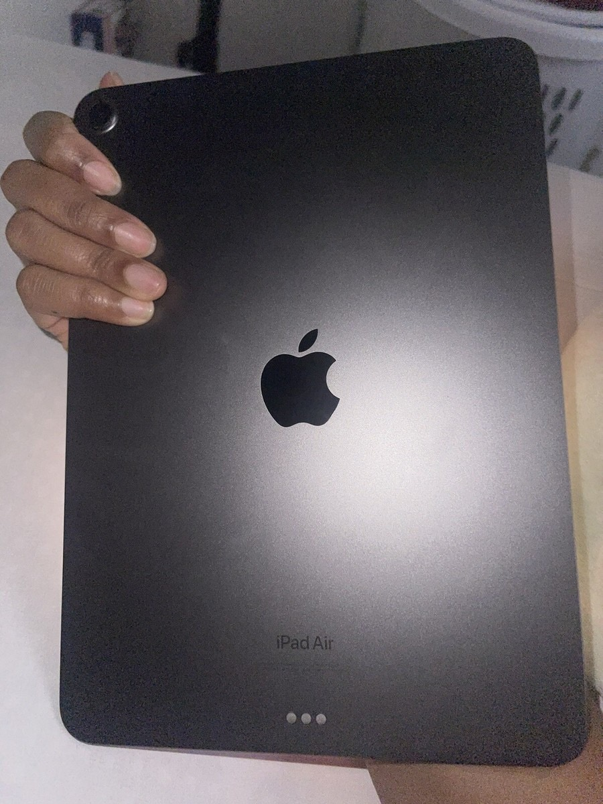

# Liquid

**Take a picture. Set a deadline. Get it listed everywhere it can sell.**

Entry for the [Multi-App AI Agent Hackathon](https://multiappagenthackathon.com), September 13, 2026.
Team: Ryan Cortenbach ([@ryancortenbach](https://github.com/ryancortenbach)) and Tensae L
([@SpectrrT](https://github.com/SpectrrT)).

## 01 Project overview

Liquid is a seller-only agent that lives in iMessage. You text it a photo of something you want
gone and a sentence like "sell by Sunday, not under 220"; it identifies the item, produces a
truthful cleaned-up listing photo you approve, asks two short questions, pulls sold and active
eBay comps, prices for your deadline, writes the listing, publishes to eBay on "go", hands you
copy-ready posts for Facebook Marketplace and OfferUp, then steps the price down on its own
schedule and tells you when it does. The problem it solves: listing well takes an hour of
photography, research, and copywriting that most people skip, so their stuff sits unsold or
sells cheap. Running cost is about $0.35 per listing (one image edit, two vision and chat calls,
two comps scrapes, all at list prices).

**What is real today and what is not**

| Piece | Status on September 13 |
|---|---|
| iMessage in and out (BlueBubbles) | Live. Five real items intaken over text today. |
| OpenAI photo identification and truthful photo edit | Live. Pair below is from today. |
| Apify eBay sold and active comps | Live on a teammate's machine. Without `APIFY_TOKEN` the card is labeled "offline sample data". |
| Deadline pricing, repricing, ledger, invariants | Live, deterministic, no LLM in the loop. |
| eBay Sell API publish (sandbox) | Built and tested; developer keys did not arrive today, so the demo ran in disclosed `EBAY_DEMO_MODE`. No live eBay publish happened. |
| Gmail offer and sale detection | Built and unit-tested; the live OAuth consent flow was not exercised today. |
| Facebook Marketplace and OfferUp | Copy-ready handoff files by design. Neither has a posting API. |

Demo listing produced today by the demo-mode eBay path (served from a laptop, may be offline):
<https://sara-camel-jon-contractors.trycloudflare.com/demo/ebay/listings/demo-listing-856972f6fbb6>

## 02 External apps used

| App | Direction | What Liquid does with it | Where in the code |
|---|---|---|---|
| iMessage via BlueBubbles | read and write | Receives photos and text from the seller, sends previews, questions, the listing card, alerts. Webhook plus poller, per-sender serialization, dedupe, allowlist. | `app/channels/` |
| OpenAI (`gpt-5.4-mini` vision and chat, `gpt-image-2.5-sunburst`) | write | Identifies the item, edits the photo under a truth contract, runs an original-vs-edit truth check, parses conversational intents. | `app/inbound/`, `app/photos/`, `app/channels/chat_ai.py` |
| Apify (`blackfalcondata~ebay-sold-listings-scraper`, `logiover~ebay-scraper`) | read | Sold and active comps for the identified item, feeding the price prior. | `app/research/` |
| eBay Sell API (sandbox) | write | Inventory item, offer, publish, reprice, cleanup. Per-seller OAuth with encrypted refresh tokens. Demo mode today, see above. | `app/market/` |
| Gmail | read and write | Per-seller OAuth, polls for eBay and Facebook offer and sold mail, matches to listings, sends alerts. Not exercised live today. | `app/mail/` |

Facebook Marketplace and OfferUp receive generated handoff files (`data/handoff/`), not API calls.

## 03 Setup instructions

The judge path needs no iMessage and no eBay keys. Python 3.12+ and [uv](https://docs.astral.sh/uv/).

```bash
git clone https://github.com/ryancortenbach/liquid-agent.git && cd liquid-agent
uv sync --all-extras
cp .env.example .env
```

Edit `.env`:

```
OPENAI_API_KEY=sk-...        # required for the photo beat and eBay demo publish
APIFY_TOKEN=apify_api_...    # optional; without it comps are a labeled offline fixture
EBAY_DEMO_MODE=true
MODE=demo
```

Run the server, then drive the whole seller flow over the API with any product photo:

```bash
uv run uvicorn app.main:app
uv run python demo/run_demo.py --photo path/to/photo.jpg --skip-hours 30
```

You will see: create item, identify, enhance, approve, two detail answers, listing plan with comps,
"go", the eBay demo listing URL plus Facebook and OfferUp handoff files, a 30 hour clock skip, and a
reprice with its reason. Open `http://localhost:8000/dashboard` for the item, its photos, ledger,
and packs. `http://localhost:8000/docs` has the API.

Run the tests:

```bash
uv run pytest        # 172 passed
```

Optional appendices: iMessage (BlueBubbles install, `BB_*` values, `SELLER_HANDLE`) and the real eBay
sandbox (`scripts/ebay_authorize.py`, `scripts/ebay_setup.py`, `scripts/ebay_verify.py --publish`)
are in [docs/08-setup.md](docs/08-setup.md). Gmail OAuth setup is there too.

## 04 Reliability testing

**Tests.** `uv run pytest` runs 172 tests across 36 files: unit, API, Hypothesis property tests,
clock, simulation, sale claims, photo pipeline, iMessage safety and flow, email parsing, eBay
publish and OAuth, research, pricing, intake, listing flow, and dashboard.

**Invariants enforced in code, each with a test.** Full list in
[docs/05-reliability.md](docs/05-reliability.md).

| Invariant | Test |
|---|---|
| No price below the seller's floor without seller approval | `test_guard.py::test_all_below_floor_counters_are_rejected` |
| At most one ACTIVE sale claim per item; SOLD is terminal | `test_sale_claims.py`, `test_database_invariants.py` (partial unique index) |
| No offer accepted after the deadline | `test_guard.py::test_accept_after_deadline_is_rejected` |
| A live price never increases without a seller replan | `test_guard.py::test_live_price_increase_is_rejected` |
| Nothing publishes without the seller's explicit "go" | `test_listing_flow.py`, `test_seller_price.py::test_change_requests_are_not_a_bare_go` |
| Enhanced photo never replaces the original; needs approval | `test_photo_enhancement.py` |
| Price comes from a real comps prior, never a placeholder | `test_price_prior.py::test_no_comps_falls_back_to_the_prior_not_a_placeholder` |
| Only the allowlisted seller, only the Liquid alias, never group chats | `test_imessage_safety.py`, `test_handle_allowlist.py` |
| Every event id processed once; delayed duplicates ignored | `test_bluebubbles.py`, `test_imessage_flow.py` |

**Photo truth check.** Every edit is compared against the original by a second model call that
blocks changed products or hidden defects. Today's iPad Air, original on the left, approved edit on
the right. The hand, the label, and the finish are unchanged; only lighting and background moved.

| Original | Enhanced and approved |
|---|---|
|  |  |

**Simulation.** `sim/` runs the same pricing engine that prices real items against a seeded market
(Poisson arrivals, noisy willingness to pay, lowballs, ghosting, fees). 12,000 policy runs, four
deadlines, three item archetypes. Full table in [docs/eval/results.md](docs/eval/results.md).

| Deadline | Agent | Static list | Static 90% | Linear markdown | Oracle | Agent sale rate | Violations |
|---:|---:|---:|---:|---:|---:|---:|---:|
| 12h | $212 | $134 | $155 | $156 | $232 | 70% | 0 |
| 24h | $226 | $191 | $195 | $199 | $254 | 89% | 0 |
| 72h | $245 | $225 | $203 | $217 | $280 | 97% | 0 |
| 168h | $260 | $225 | $202 | $221 | $296 | 99% | 0 |

**Live evidence from today.** The local log for today's iMessage sessions shows 33 inbound
messages completed, 32 delayed BlueBubbles redeliveries caught by the dedupe layer with zero
duplicate replies, and 10 messages from a non-allowlisted number refused before any model call.
Every action, including refused ones, writes a ledger row with its inputs and reason; the dashboard
shows it per item.

**Honest labeling.** Offline comps are marked "offline sample data" on the card. When the eBay
sandbox is not configured the pack shows the reason, and demo mode is disclosed on the listing
page itself. Nothing is silently skipped.

**Known limitations.** eBay publishing ran only in demo mode today (keys pending). Gmail detection
is unit-tested but not exercised live. Facebook and OfferUp are pasted by the seller. Generated
photo fidelity still requires the seller's approval. The simulator does not yet model response
latency or delayed settlement.

## 05 Demo video

Two minutes, both of us on camera, then the product. Under 100 MB so it lives in the repo:

**[demo/video/liquid-demo.mp4](demo/video/liquid-demo.mp4)** (click, then press play on the GitHub page)

---

## Channel model

| Channel | Publishing mode |
|---|---|
| eBay | Automated through the official Inventory API. Sandbox for the hackathon demo. |
| Facebook Marketplace | Assisted. Liquid prepares and fills the listing, then the seller approves publication. |
| Craigslist and OfferUp | Assisted until an approved API or partner integration is available. |
| Other channels | Added through adapters with explicit capability and policy checks. |

## Docs

| File | What it defines |
|---|---|
| [docs/00-brief.md](docs/00-brief.md) | Hackathon brief, rubric, and scoring strategy |
| [docs/01-product.md](docs/01-product.md) | Seller-only product and feature priorities |
| [docs/02-architecture.md](docs/02-architecture.md) | Architecture, data model, and state transitions |
| [docs/03-engine.md](docs/03-engine.md) | Deadline pricing and cross-channel offer policy |
| [docs/04-integrations.md](docs/04-integrations.md) | Marketplace and seller-interface integrations |
| [docs/05-reliability.md](docs/05-reliability.md) | Invariants, tests, evaluation, and disclosure |
| [docs/06-demo.md](docs/06-demo.md) | Two-minute seller workflow demo |
| [docs/07-schedule.md](docs/07-schedule.md) | Build order and cut lines |
| [docs/08-setup.md](docs/08-setup.md) | Accounts, keys, and local setup |
| [docs/09-brief-template.md](docs/09-brief-template.md) | Submission brief template |
| [docs/10-build-status.md](docs/10-build-status.md) | Current implementation and next work |
| [docs/11-collaboration.md](docs/11-collaboration.md) | Independent branch workflow for collaborators |

## Feature walkthrough

```bash
uv sync
uv run pytest
uv run python scripts/run_local.py --reload
```

Open `http://localhost:8000/docs` for the API. `POST /api/plan` previews a liquidity
frontier. `POST /api/items` creates an item, and `POST /api/items/{item_id}/tick` runs the
guarded decision path shared by real, demo, and simulation clocks.

For the photo flow, set `OPENAI_API_KEY`, upload an image to
`POST /api/items/{item_id}/photos/enhance`, compare the returned original and enhanced URLs, then
approve or reject it through `POST /api/items/{item_id}/photos/{photo_id}/review`. Enhanced photos
never enter the listing image set before approval.

For iMessage, configure BlueBubbles and the webhook values described in `docs/08-setup.md`. A
seller can then text a photo and caption, receive the original and enhanced versions, and reply
`APPROVE` or `REJECT` without using the API directly.

Set `SELLER_HANDLE=*` during multi-user testing so every sender receives an isolated seller
conversation. The local runner records accepted messages with a masked sender, message id, text,
and attachment count so failed or confusing flows can be reviewed without exposing full phone
numbers in the logs.

Set `BB_ALLOWED_DESTINATION` to the dedicated iMessage email used by Liquid. Messages addressed to
any other phone number or email are ignored before deduplication, OpenAI processing, or replies.

Attach several photos normally to use them as angles of one item. To submit several items at once,
start the caption with `BATCH` and attach one primary photo per item. If items have several angles,
use counts such as `BATCH 2+3`, where the first two attachments are item 1 and the next three are
item 2. Liquid accepts corrections such as `2 is Bose QC45`, reviews the generated set together,
and then walks through the listings one item at a time.

A single photo containing several products is also treated as an inventory scene. Liquid detects
and crops each sellable object, presents a numbered checklist, and creates one item per confirmed
object. Reply `REMOVE 3` to exclude something that is not for sale, or rename it with `3 is ...`.
The uncropped source image is retained for auditability.

The eBay sandbox path is `POST /api/items/{item_id}/publish/ebay`. It creates a draft from approved
photos first. The offer is published only when the request explicitly includes
`"seller_approved": true`, and Liquid marks it live only after eBay returns a listing id. Three
scripts take a fresh sandbox keyset to a verified listing: `scripts/ebay_authorize.py` mints the
refresh token (paste the redirect URL, no public callback needed), `scripts/ebay_setup.py` creates
the business policies and ship-from location and writes their ids to `.env`, and
`scripts/ebay_verify.py --publish` proves comps, category, auth, photo hosting, draft, publish,
reprice, and cleanup live. Photos are hosted on eBay Picture Services at publish time, so no
tunnel is required. Details in `docs/08-setup.md`.

If eBay developer approval is still pending, set `EBAY_DEMO_MODE=true`. Seller onboarding then
completes locally, the rest of the real workflow remains active, and publication returns a working
Liquid-hosted listing preview with an explicit demo disclosure. Turning the flag off restores the
normal per-seller OAuth and official eBay publishing path.

At any point in Messages, `STATUS` reports progress, `RESUME` repeats the next step, `BACK`
explains how to revise the current step, and `START OVER` cancels the active draft safely.
With `OPENAI_CHAT_ENABLED=true`, a structured intent layer uses the saved workflow state and recent
seller messages to understand conversational requests and references. The deterministic workflow
still owns onboarding, photo approval, listing approval, and publishing. Each seller's messages are
processed serially so delayed BlueBubbles deliveries cannot trigger duplicate replies.

After eBay onboarding, reply `CONNECT EMAIL` to connect the seller's Gmail account. Liquid watches
authenticated eBay and Facebook Marketplace mail for offers and sold events, deduplicates messages,
and matches them to the seller's listings. Safe matches update the offer or sale state. Ambiguous
messages ask for review. Alerts arrive through both Gmail and iMessage, and every successful eBay
publication includes the returned live listing URL in both channels. Gmail setup and public OAuth
verification requirements are in `docs/08-setup.md`.

For per-seller OAuth, configure the eBay application credentials, RuName, `APP_SECRET`, and a
public `PUBLIC_BASE_URL`. Every seller is placed into eBay onboarding on their first text, and
Liquid processes nothing until they approve access. Liquid stores only an encrypted refresh token
for that seller and resolves their connection when publishing. The link expires after 10 minutes,
and `RETRY` issues a fresh one. A shared sandbox refresh token can verify the developer setup, but
it never bypasses seller onboarding.
